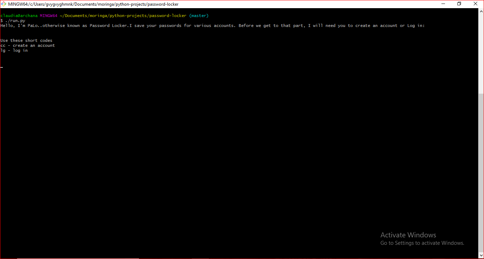

# PASSWORD LOCKER
#### Password locker is an application that allows you to store your account credentials v1.0.0
#### By ****Claudia Njeri****

Introducing Password Locker,(PaLo). This is an app that enables you to save the details of the different accounts you might have.

## User Story
As a user, you can:
* > create an account with your details - log in and password
* > Store your existing login credentials
* > Generate a password for a new credential/account

## Installation
* > Live app @ 
 https://github.com/claudianjeri/password-locker
* > Clone or download the files
* > Ensure python is installed on your machine
* > On the terminal for linux or command prompt for windows;
  * Open the containing folder.
  * Run ./run.py
* > Follow the instructions to add details.

## Requirements
* > Browser
* > Good internet connection
* > For windows users;  GitBash
* > For linux/ubuntu users; Git

## Technologies used

* > This is mainly a python application
## Known Bugs.
* > There are no known bugs. If found, contact me at claudianjeri04@gmail.com
## Support and contact details
* > Email Address: claudianjeri04@gmail.com

## License and terms of use
* > MIT LICENSE
* > This application's source code is free for any open source project.

 © Claudia Njeri| Credits [Moringa School](https://moringaschool.com/) 